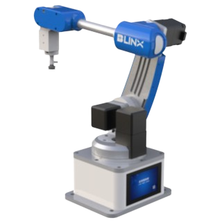
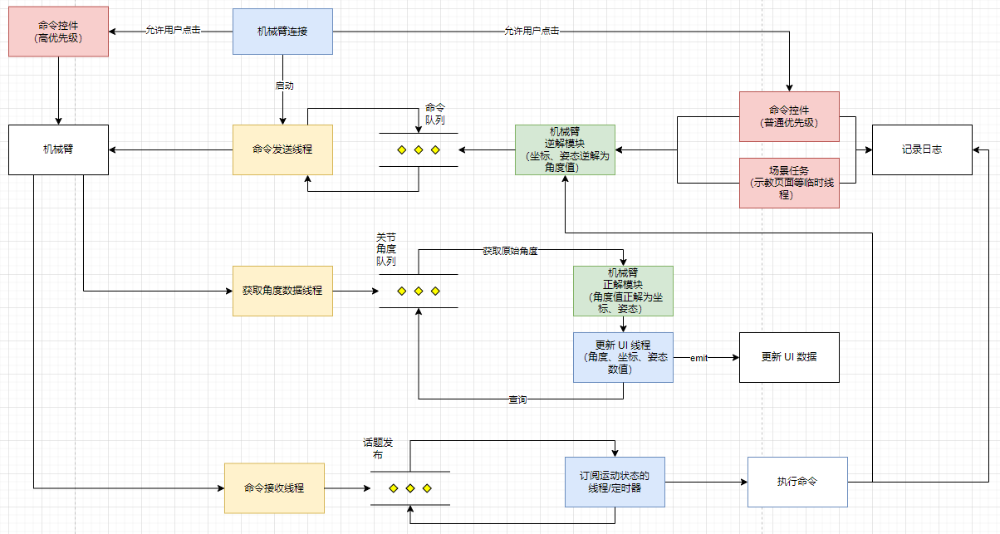

<p align="center">
  <a href="" rel="noopener">
 </a>
</p>

<h3 align="center">六轴机器人上位机</h3>
<h3 align="center">Open R6 </h3>

<div align="center">

[]()

</div>

---

<p align="center">用 <strong>Open R6</strong> 机械臂，推开机器人世界的大门
    <br> 
</p>

## 📝 目录

- [📝 目录](#-目录)
- [🧐 介绍 ](#-介绍-)
- [🏁 开发步骤 ](#-开发步骤-)
  - [拉取代码](#拉取代码)
  - [安装依赖](#安装依赖)
  - [运行](#运行)
- [🎈 开始使用 ](#-开始使用-)
- [⛏️ 技术栈 ](#️-技术栈-)
- [🖼️ 程序设计 ](#️-程序设计-)
  - [上位机软件设计框图](#上位机软件设计框图)
- [🦾 机械臂参数说明](#-机械臂参数说明)
  - [参数规格](#参数规格)
  - [轴运动参数](#轴运动参数)
- [📏 物理特性](#-物理特性)
  - [MDH 参数](#mdh-参数)
  - [DH 参数](#dh-参数)
  - [机械臂电机方向与角度范围](#机械臂电机方向与角度范围)

## 🧐 介绍 <a name = "about"></a>

比邻星开源六轴机械人 `Open R6` 上位机控制程序
项目的 GUI 采用的是 `PySide6` 和 `QFluentWidgets` 组件库
可通过网络、`WiFi`、蓝牙、串口通讯方式，控制机械臂的六个关节进行复杂灵活的运动

## 🏁 开发步骤 <a name = "getting_started"></a>

接下来，将为您说明如何在您的本地计算机上，启动并运行的机械臂上位机的项目源代码，以用于开发或教学目的。

> 如果您只需使用打包好的上位机程序，有关如何在您的操作系统上，安装打包好的上位机程序的说明，请参阅更详细的安装手册，上位机的安装包可在 Release 页面找到

### 拉取代码

拉取本仓库代码

```bash
git clone http://192.168.10.205:10880/Education_Department/blinx_robot_arm_control.git
```

> 或直接打开下载好的项目文件

`blinx_robot_arm_control` 项目结构如下

```txt
├─app ------------------------ // 上位机子页面源码
│ ├─command_page.py ---------- // 示教控制页面【 command_page.ui 生成】
│ ├─connect_page.py ---------- // 连接配置页面【 connect_page.ui 生成】
│ ├─teach_page.py ------------ // 示教控制页面【 teach_page.ui 生成】
│ └─__init__ 
├─assets --------------------- // 存放静态资源的目录
│ ├─icons -------------------- // 工具等自定义小图标
│ └─images ------------------- // 背景等稍大一些的图片文件
├─common --------------------- // 一些公共的函数或类
│ ├─check_tools.py ----------- // 检查机械臂状态的一些装饰器函数
│ ├─settings.py -------------- // 存放项目的路径配置信息
│ ├─socket_client.py --------- // 机械臂的通讯函数
│ ├─work_threads.py ---------- // 上位机的核心工作线程
│ └─__init__.py 
├─componets ------------------ // 自定义组件
│ ├─table_view_control.py ---- // 示教页面的表格内容控制器
│ └─__init__.py 
├─config --------------------- // 存放机械臂的连接信息
├─docs ----------------------- // 上位机的文档
├─logs ----------------------- // 上位机的运行日志
├─main.py -------------------- // 上位机主程序文件
├─README.md 
├─requirements.txt ----------- // 运行上位机需要的第三方模块
├─tests ---------------------- // 测试代码存放目录
│ └─__init__.py 
└─ui ------------------------- // 上位机界面文件，用 Qt Designer 编辑
  ├─command_page.ui ---------- // 命令控制页面
  ├─connect_page.ui ---------- // 连接配置页面
  └─teach_page.ui ------------ // 示教控制页面
```

### 安装依赖

> 为了避免与您当前操作系统中，已经存在的 python 模块冲突，建议使用虚拟环境，确保程序能够正常运行！否则造成的意外情况，后果自负！

**新建 python 虚拟环境，python 版本需要 >= 3.8**

```bash
# 进入到项目的根目录中
cd blinx_robot_arm_control

# 激活虚拟环境
python -m venv venv
# win
venv\Scripts\activate.bat
# unix 类系统
source venv/bin/acvitate
# 安装项目依赖
python -m pip install -i https://pypi.tuna.tsinghua.edu.cn/simple --upgrade pip
pip install -r requirements.txt -i https://pypi.tuna.tsinghua.edu.cn/simple
```

### 运行

完成环境的部署，接下来可以运行上位机的主程序

```bash
python main.py
```

命令行终端日志提示


上位机主界面


## 🎈 开始使用 <a name="usage"></a>

关于上位机的连接配置、以及详细操作说明请参阅：**《六轴机器人操作手册》**

## ⛏️ 技术栈 <a name = "built_using"></a>

- [vs code](https://code.visualstudio.com/) - Visual Stdio Code
- [qfluent widget](https://qfluentwidgets.com/) - 在设计师中拖拖拽拽，无需书写 QSS，即可快速构建美观的界面
- [PySide6](https://pypi.org/project/PySide6/) - python 桌面 GUI 框架

## 🖼️ 程序设计 <a name = "design">

### 上位机软件设计框图




## 🦾 机械臂参数说明

>  下面是关于机械臂的一些电气物理参数介绍

### 参数规格

| 轴数         | 6+1                                      |
|:---:|:---:|
| 有效负载     | 1000 g                                   |
| 重复定位精度 | 0.1 mm                                   |
| 通信接口     | 有线 / WIFI / Bluetooth / RS485 / Type-C |
| 电源电压     | 100 V- 240 V, 50/60 HZ                   |
| 电源输入     | 12 V / 5A DC                             |
| 功率         | 60W Max                                  |
| 工作环境     | -10℃ - 80℃                               |

### 轴运动参数

| 轴   | 工作范围         | 最大速度（500 g负载） |
|:--:|:--:|:--:|
| 轴 1 | -136°to + 136°   | 45°/ s                |
| 轴 2 | -85°to + 97°     | 45°/ s                |
| 轴 3 | -91° to + 47°    | 45°/ s                |
| 轴 4 | -141°to + 182°   | 45°/ s                |
| 轴 5 | -220° to + 30°   | 27°/ s                |
| 轴 6 | -360­° to + 360° | 45°/ s                |

## 📏 物理特性

| 净重（机械臂）       | 4.8 KG              |
|:--:|:--:|
| 底座尺寸（长x宽x高） | 170mm x 135mm x 8mm |
| 材料                 | 铝合金 高韧性树脂   |
| 控制器               | STM 32              |
| 机器人安装           | 桌面                |

### MDH 参数

| 关节 | alpha   | a      | d       | theta   |
| ---- | ------- | ------ | ------- | ------- |
| 1    | 0       | 0      | 153.50  | 0       |
| 2    | -pi / 2 | 24     | 0       | -pi / 2 |
| 3    | 0       | 160.72 | 0       | 0       |
| 4    | -pi / 2 | 0      | 223     | 0       |
| 5    | pi / 2  | 0      | 0       | pi/2    |
| 6    | pi / 2  | 0      | -108.79 | 0       |


### DH 参数

| 关节 | alpha  | a      | d       | theta   |
| ---- | ------ | ------ | ------- | ------- |
| 1    | -pi/2  | 24     | 153.50  | 0       |
| 2    | 0      | 160.72 | 0       | -pi / 2 |
| 3    | -pi/2  | 0      | 0       | 0       |
| 4    | pi / 2 | 0      | 223     | 0       |
| 5    | pi / 2 | 0      | 0       | pi/2    |
| 6    | 0      | 0      | -108.79 | 0       |


###  机械臂电机方向与角度范围

> 先将屏幕面向操作者，将机械臂回零，再确定电机的角度正负值，以及对应的控制方向
>
> 需要与正逆解模型的角度方向一致

| 电机编号 | 方向   | 负值（度） | 正值(度) | 方向   | 备注 |
| -------- | ------ | ---------- | -------- | ------ | ---- |
| 1        | 顺时针 | -136       | +136     | 逆时针 | 俯视 |
| 2        | 顺时针 | -85        | +97      | 逆时针 | 左视 |
| 3        | 顺时针 | -91        | +47      | 逆时针 | 左视 |
| 4        | 逆时针 | -141       | +182     | 顺时针 | 正视 |
| 5        | 顺时针 | -220       | +30      | 逆时针 | 左视 |
| 6        | 顺时针 | -360       | +360     | 逆时针 | 俯视 |

